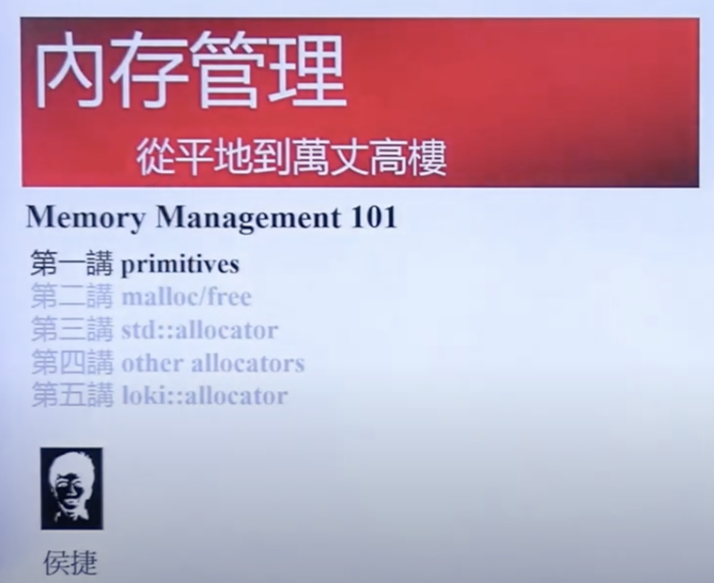
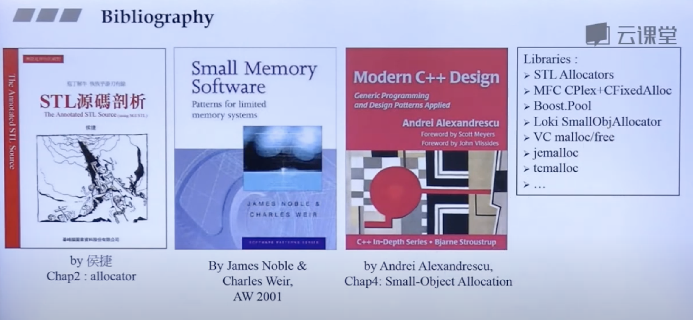

# 内存管理 Memory Management 101  侯捷

- https://www.youtube.com/watch?v=N27j6snKcxI&list=PLTcwR9j5y6W2eH37R2_4oEO4Y0tksot56

## key points
- C++ 如何分配内存, 基础工具
- STL std::allocator
- malloc / free
- Other allocator

## Source code
- VC 6.0
- Dev-C++ 5.11 & GNU 4.92
- Doug Lea's Home page

## Books

