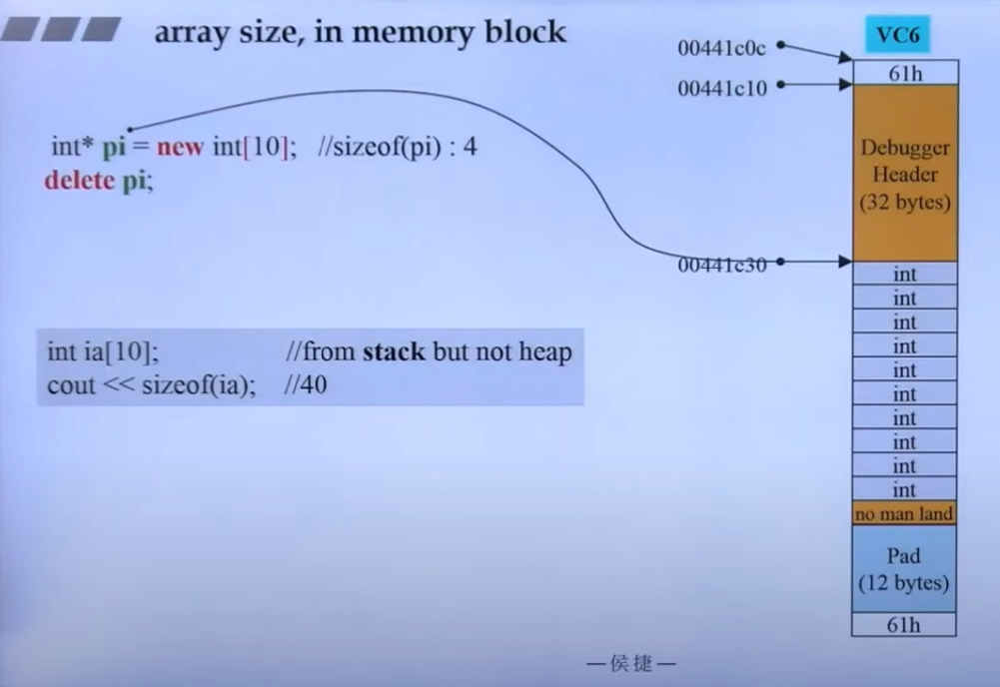

GUN 4.9


## new expression (VC)

_callnewh(size) 用于release memory when malloc() failed


## delete expression


## Call constructor and distructor
实验证明不能直接调用constructor


## array new, array delete

array new 会调用class的defult constructor, 此处无法调用带参数的contructor

```
  new(obj_pointer)A(i)
```
用来调用obj_pointer处的constructor

## array size in memory block
size of memory block要是16的整数倍


对于 int array, delete 可以不用加[]


## placement new
